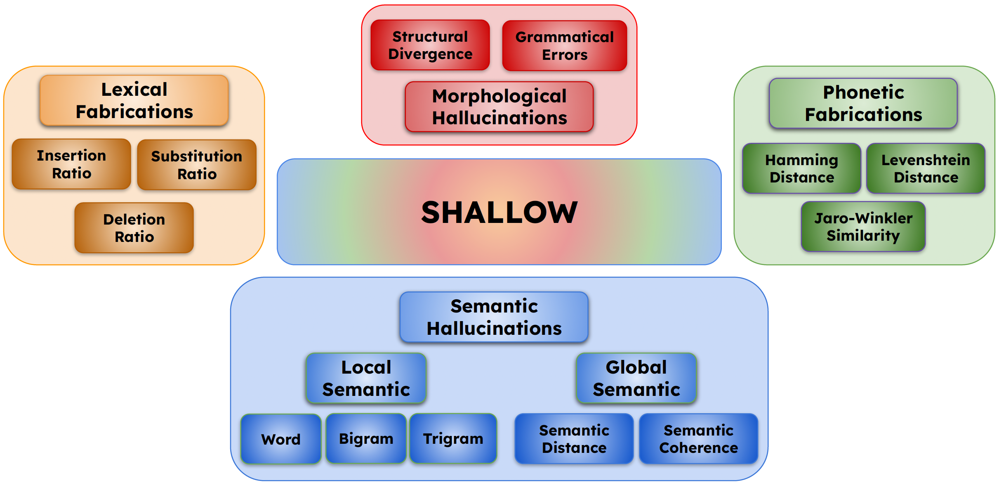
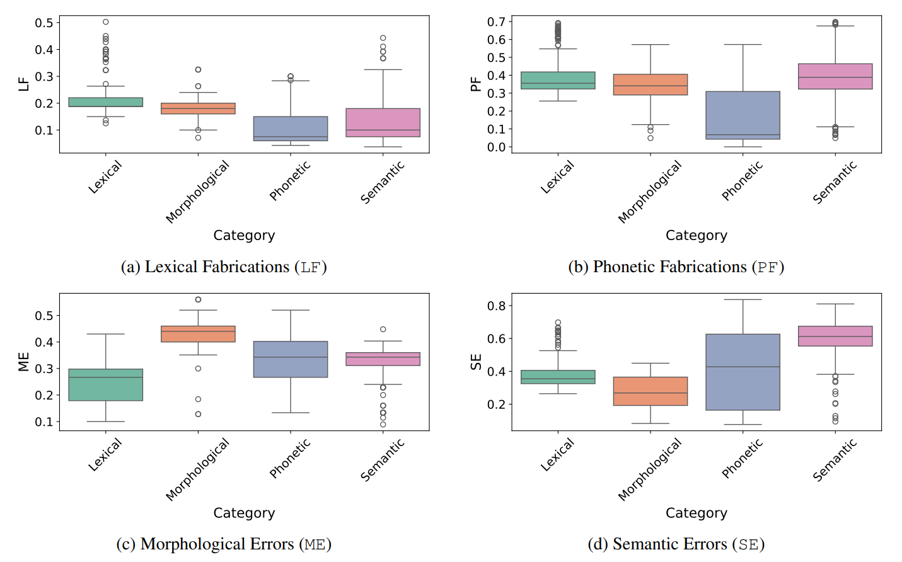
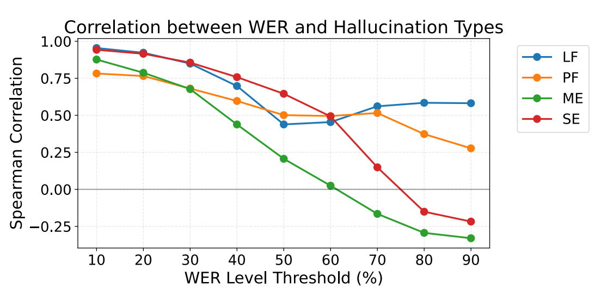

# SHALLOW: A Multi-Dimensional Benchmark for ASR Hallucination Evaluation

[](https://anonymous.4open.science/r/SHALLOW/)
[](LICENSE)

**SHALLOW** (**S**peech **HALL**allucination **O**vervie**W**) is a multi-dimensional benchmark framework for fine-grained evaluation of ASR hallucinations.
It decomposes transcription errors into four complementary dimensions: Lexical Fabrications (LF), Phonetic Fabrications (PF), Morphological Errors (ME), and Semantic Errors (SE), each targeting a distinct class of hallucination that WER alone cannot capture.



## Table of Contents

- [Installation](#installation)
- [Usage](#usage)
- [Example](#example)
- [Output Files](#output-files)
- [Overview](#overview)
- [SHALLOW Metrics](#shallow-metrics)
  - [Lexical Fabrications (LF)](#1-lexical-fabrications-lf)
  - [Phonetic Fabrications (PF)](#2-phonetic-fabrications-pf)
  - [Morphological Errors (ME)](#3-morphological-errors-me)
  - [Semantic Errors (SE)](#4-semantic-errors-se)
- [Preprocessing](#preprocessing)
- [Datasets](#datasets)
- [Models](#models)
- [Results](#results)
- [Synthetic Benchmark Dataset](#synthetic-benchmark-dataset)
  - [Motivation](#motivation)
  - [Dataset Composition](#dataset-composition)
  - [Generation Methodology](#generation-methodology)
  - [Metric Validation](#metric-validation)
  - [Spearman Correlation Analysis](#spearman-correlation-analysis)
- [Metric Implementation Details](#metric-implementation-details)
  - [Lexical Fabrication Implementation](#lexical-fabrication-implementation)
  - [Phonetic Fabrication Implementation](#phonetic-fabrication-implementation)
  - [Morphological Error Implementation](#morphological-error-implementation)
  - [Semantic Error Implementation](#semantic-error-implementation)
- [Comprehensive Results](#comprehensive-results)
  - [Model-Level Trade-Offs](#model-level-trade-offs)
  - [Dataset-Specific Sensitivities](#dataset-specific-sensitivities)
- [Additional Analysis](#additional-analysis)
  - [Correlation across WER Thresholds](#correlation-across-wer-thresholds)
- [Few Examples](#few-examples)
- [Computational Resources](#computational-resources)
- [License](#license)
- [Contact](#contact)
- [Citation](#citation)

## Installation

```bash
pip install -r requirements.txt
```

## Usage

```bash
python main.py \
  --dataset_name DATASET_NAME \
  --model_name MODEL_NAME \
  --gt_transcriptions_path hyp.txt \
  --predictions_path ref.txt \
  --output_dir results/
```

Replace `DATASET_NAME` and `MODEL_NAME` with the appropriate values for your dataset and model.
`gt_transcriptions_path` and `predictions_path` should point to the ground truth and predicted transcriptions respectively.
`output_dir` is where the results (metrics and statistics) will be saved.

Input files must follow this format:

```
audio1.wav: this is the first audio
audio2.wav: this is the second audio
...
```

**All arguments:**

| Argument | Type | Default | Description |
|---|---|---|---|
| `--dataset_name` | str | `ls` | Dataset to test |
| `--model_name` | str | `canary1b` | Model to test |
| `--gt_transcriptions_path` | str | `ls_gt.txt` | Path to ground truth transcriptions |
| `--predictions_path` | str | `ls_canary1b.txt` | Path to predictions |
| `--output_dir` | str | `results/` | Path to the output directory |
| `--num_workers` | int | `4` | Number of parallel worker processes |
| `--examples_limit` | int | `-1` | Limit number of examples to process (-1 = no limit) |
| `--verbose` | flag | `False` | Enable verbose output |

## Example

To run the SHALLOW benchmark on the CHiME-6 dataset with the Canary 1B model:

```bash
CUDA_DEVICE=0
DATASET_NAME=chime6
MODEL_NAME=canary1b

CUDA_VISIBLE_DEVICES=$CUDA_DEVICE python main.py \
  --dataset_name $DATASET_NAME \
  --model_name $MODEL_NAME \
  --gt_transcriptions_path gt/${DATASET_NAME}_gt.txt \
  --predictions_path inference/${DATASET_NAME}/${DATASET_NAME}_${MODEL_NAME}.txt \
  --output_dir results/ \
  --examples_limit 50 \
  --num_workers 2
```

This runs SHALLOW on the first 50 examples of CHiME-6 using Canary 1B and saves results to `results/`.
The `--num_workers` argument specifies the number of workers for parallel processing; adjust based on your system.

## Output Files

Each run produces three files in `output_dir/`:

| File | Description |
|---|---|
| `shallow_metrics_{dataset}_{model}_partial.csv` | Raw per-utterance metrics (safe checkpoint written before aggregation) |
| `shallow_metrics_{dataset}_{model}.csv` | Full per-utterance metrics including all aggregated SHALLOW scores |
| `shallow_stats_{dataset}_{model}.json` | Dataset-level summary statistics |

The JSON summary file has the following structure:

```json
{
    "wer_score": 34.16,
    "lexical_fabrication_score": 13.20,
    "phonetic_fabrication_score": 32.76,
    "morphological_hallucination_score": 19.00,
    "semantic_hallucination_score": 25.17
}
```

## Overview

Word Error Rate (WER) is the dominant metric in ASR evaluation, but it treats all errors equally and provides no insight into the structure or nature of those errors.
SHALLOW addresses this by decomposing ASR errors into four independent dimensions, each targeting a specific hallucination type.
The framework is validated on a controlled synthetic dataset of 1,050 hypothesis-reference pairs with known ground-truth error types, and evaluated across 12 ASR systems and 10 speech corpora spanning standard, noisy, accented, and specialized domains.

---

## SHALLOW Metrics

### 1. Lexical Fabrications (LF)

LF measures word-level deviations between reference and hypothesis, decomposed into insertions, deletions, and substitutions.

**Aggregated score:**

```
LF = 0.5 × insertion_ratio + 0.3 × substitution_ratio + 0.2 × deletion_ratio
```

**Weight rationale:**
Insertions receive the highest weight because they introduce fabricated content with no acoustic basis in the source audio.
Substitutions receive a moderate weight because they replace a word while preserving its structural position.
Deletions receive the lowest weight because they omit content rather than introducing false information.
Differential weighting of ASR error types is well-motivated: equal-weight metrics have been shown to misalign with human perception of transcription quality (Hunt 1989, Morris et al. 2004, Mishra et al. 2011).

**Component definitions:**
- `insertion_ratio` = insertions / hypothesis word count
- `deletion_ratio` = deletions / reference word count
- `substitution_ratio` = substitutions / reference word count

---

### 2. Phonetic Fabrications (PF)

PF evaluates the degree of phonetic dissimilarity between reference and hypothesis using metaphone-encoded phonetic representations.

**Aggregated score:**

```
PF = (hamming_norm + levenshtein_norm + (1 - jaro_winkler)) / 3
```

**Component definitions:**
- `hamming_norm`: Hamming distance between metaphone encodings, normalized by `max(len(ref_meta), len(hyp_meta))`
- `levenshtein_norm`: Levenshtein distance between metaphone encodings, normalized by `max(len(ref_meta), len(hyp_meta))`
- `1 - jaro_winkler`: Jaro-Winkler similarity inverted to a distance

**Note on PF interpretation:**
PF scores are *lower* for phonetically plausible substitutions (e.g., *there* → *their*).
This is correct by design: the metric detects phonetic proximity rather than penalizing all substitutions equally.
In the synthetic validation, PF is minimized on phonetic samples, confirming the metric works as intended.

---

### 3. Morphological Errors (ME)

ME assesses structural and grammatical distortions in ASR outputs, combining syntactic tree comparison with grammar checking.

**Aggregated score:**

```
ME = 0.4 × structural_divergence + 0.6 × grammatical_error_score
```

**Structural divergence (SD):**

Computed as Jaccard distance between the dependency relation sets of reference and hypothesis:

```
SD = 1 - |R ∩ H| / |R ∪ H|
```

where R and H are sets of `(head_token, dependency_relation, token)` triples extracted using spaCy (`en_core_web_sm`) with the Benepar constituency parser (`benepar_en3`).

**Grammatical error score (GE):**

```
GE = (0.4 × grammar_errors + 0.4 × spelling_errors + 0.2 × punctuation_errors) / n_words
```

Errors are detected using `LanguageToolPublicAPI` by checking whether `'grammar'`, `'spell'`, or `'punctuat'` appears in the error message text.

**Weight rationale:**
Grammatical errors receive the highest overall weight (via GE weight of 0.6 in ME) because they directly alter tense, number agreement, and sentence structure, all of which affect meaning.
Structural divergence receives a lower weight (0.4) because it captures surface-level syntactic differences that more often preserve core semantics.
Within GE, grammar and spelling errors are equally weighted (0.4 each) as both produce incorrect word forms; punctuation errors receive a lower weight (0.2).

---

### 4. Semantic Errors (SE)

SE evaluates the preservation of meaning between reference and hypothesis, combining local semantic errors (affecting short spans) with global semantic coherence (affecting overall meaning).

**Aggregated score:**

```
SE = 0.25 × local_semantic_score + 0.75 × global_semantic_score
```

**Local semantic score (LS):**

Measures divergence using a multi-scale sliding window approach over contextual BERT (`bert-base-uncased`) embeddings:

```
LS = 0.5 × (1 - window_1_score) + 0.3 × (1 - window_2_score) + 0.2 × (1 - window_3_score)
```

For each window size w ∈ {1, 2, 3} (unigrams, bigrams, trigrams):
1. Compute contextual embeddings for each window in reference and hypothesis
2. For each hypothesis window, find the maximum cosine similarity across all reference windows of the same size
3. Average these maximum scores, normalized by `max(len(ref_words), len(hyp_words))`

Note: LS measures **divergence**: each window-level similarity is inverted (`1 - sim`) before weighting, so higher LS means more semantic error.

**Global semantic score (GS):**

```
GS = (semantic_distance + semantic_coherence_error) / 2
```

where:
- `semantic_distance = 1 - cosine_similarity` between `nli-roberta-base-v2` sentence embeddings
- `semantic_coherence_error = 1 - bertnli_score`

The `bertnli_score` is BERTScore F1 scaled by an NLI entailment factor using `facebook/bart-large-mnli`.
NLI input format: `"{reference} </s> {hypothesis}"`.
Entailment weights applied to F1:
- Entailment → multiply by `score` (model confidence)
- Neutral → multiply by `score × 0.5`
- Contradiction → multiply by `0.0`

Both components are inverted before averaging, so GS reflects the degree of semantic error rather than preservation.

**Weight rationale:**
The 0.25/0.75 ratio prioritizes sentence-level meaning preservation.
In the exhaustive weight search over the synthetic dataset, the proposed weights (LS = 0.25, GS = 0.75) achieve the highest discriminability among all tested combinations for SE.

---

## Preprocessing

All transcriptions are preprocessed before metric computation using the following pipeline in `utils.py`.

**1. GigaSpeech-specific cleaning** (applied only when `'gigaspeech'` appears in the ground truth path):

```python
PUNCTUATION_TAGS = {
    "<COMMA>": ",", "<PERIOD>": ".", "<QUESTIONMARK>": "?", "<EXCLAMATIONPOINT>": "!"
}
GARBAGE_TAGS = ["<SIL>", "<MUSIC>", "<NOISE>", "<OTHER>"]
FILLERS      = ['UH', 'UHH', 'UM', 'EH', 'MM', 'HM', 'AH', 'HUH', 'HA', 'ER']
```

Punctuation tags are replaced with their symbols, garbage tags are removed, and conversational fillers are removed using whole-word regex matching (`\b(UH|UHH|...)\b`).

**2. Model output cleaning** (applied to all datasets):

```python
text = re.sub(r"<.*?>", "", text)        # remove anything inside angle brackets
text = re.sub(r"\s+", " ", text).strip()
```

**3. Whisper normalization** (applied to all datasets):

```python
from whisper_normalizer.english import EnglishTextNormalizer
english_normalizer = EnglishTextNormalizer()
transcriptions = [english_normalizer(t) for t in transcriptions]
```

This normalizes casing, punctuation, and spelling consistently across all models and ground truths before any metric is computed.

---

## Datasets

We evaluate on 10 speech corpora covering diverse conditions, domains, and acoustic challenges.

| Dataset | # Test Utts | Domain | Characteristics |
|---|---|---|---|
| **Standard Speech** | | | |
| LibriSpeech (other) | 2,939 | Read audiobooks | Standard "other" split with more challenging samples |
| TEDLIUM | 1,469 | TED talks | Clear, prepared speech by professional speakers |
| GigaSpeech | 25,619 | Diverse sources | Audiobooks, podcasts, YouTube; diverse topics |
| **Challenging Acoustics** | | | |
| CHiME-6 | 11,027 | Dinner parties | Conversational speech with natural domestic noise |
| **Accented Speech** | | | |
| CORAAL | 5,000 | Interview speech | Regional varieties of African American Language |
| CV16-Accented | 2,197 | Crowd-sourced | English utterances with accent variation |
| GLOBE-v2 | 5,046 | Global accents | 164 accents from worldwide speakers |
| SpeechOcean | 2,500 | L2 English | Non-native speakers (L1: Mandarin); children and adults |
| **Specialized Domains** | | | |
| MyST Child | 13,180 | Educational | Children (grades 3–5) with virtual science tutor |
| VoxPopuli | 1,842 | Political speeches | Formal speaking with domain-specific terminology |

### Dataset Details

**LibriSpeech (other)** contains 2,939 test utterances from read audiobooks that typically yield low WER scores across modern systems.
We use the standard "other" split, which includes more challenging speech samples than the "clean" split.

**TEDLIUM** includes 1,469 test utterances from English-language TED talks, representing clear, prepared speech in a presentation setting with professional speakers.

**GigaSpeech** comprises 25,619 test utterances from a multi-domain corpus spanning audiobooks, podcasts, and YouTube videos, covering both read and spontaneous speech across diverse topics including arts, science, and sports, with high-quality transcriptions.

**CHiME-6** includes 11,027 test utterances recorded during real dinner parties in everyday home environments, capturing conversational speech with natural domestic noise from kitchen appliances, air conditioning, and movement across various room acoustics.

**CORAAL** contains utterances from the Corpus of Regional African American Language, sampled from sociolinguistic interviews representing regional varieties of African American Language.
It includes audio recordings with time-aligned transcriptions. We selected a subset of 5,000 test samples.

**CV16-Accented** consists of 2,197 test utterances from the CommonVoice corpus, specifically selected as English utterances labeled with accent variation.

**GLOBE-v2** provides 5,046 test utterances with worldwide English accents, covering 164 accents from over 23,000 speakers, making it ideal for testing accent generalization.

**SpeechOcean** includes 2,500 test utterances from non-native English speakers whose first language is Mandarin, with balanced data from both children and adults with expert-scored pronunciations.

**MyST Child** includes 13,180 test utterances from children in grades 3–5 conversing with a virtual science tutor, combining children's speech patterns with scientific vocabulary in educational applications.

**VoxPopuli** contains 1,842 test utterances from political speeches, offering transcribed formal speaking styles with domain-specific terminology.

---

## Models

We evaluate 12 ASR systems spanning four architecture families.

| Model | Architecture | # Params | Key Characteristics |
|---|---|---|---|
| **Self-Supervised Encoders** | | | |
| HuBERT | Encoder-only | 300M | Masked prediction objectives; fine-tuned on LibriSpeech 960h |
| MMS | Encoder-only | 1B | Multilingual (1,406 languages); language-agnostic representations |
| **Encoder-Decoder** | | | |
| Whisper-Large-v2 | Encoder-decoder | 1.5B | 680K hours weakly supervised multilingual training |
| Whisper-Large-v3 | Encoder-decoder | 1.5B | 5M+ hours training; enhanced generalization capabilities |
| Canary | Encoder-decoder | 1B | FastConformer encoder (32 layers); token-driven decoding |
| **Encoder-Transducer** | | | |
| Parakeet | Encoder-transducer | 1.1B | FastConformer-based; optimized for English speech recognition |
| **Multimodal SpeechLLMs** | | | |
| SALMONN | Decoder + encoders | 7B | Integrates LLMs with speech/audio encoders; unified processing |
| Qwen2Audio | Decoder + encoders | 8.4B | Qwen2 series; specialized audio encoders |
| Qwen2.5-Omni | Decoder + encoders | 10.7B | Enhanced Qwen2; broader multimodal capabilities |
| Granite-Speech | Decoder + encoders | 8.6B | Two-pass design for transcription and translation |
| Kimi-Audio | Decoder + encoders | 9.7B | Open audio model; unified framework for audio tasks |
| Phi4-MM-Instruct | Decoder + encoders | 5.6B | Open-weights foundation model; state-of-the-art ASR performance |

### Model Checkpoints

| Model | HuggingFace Link |
|---|---|
| HuBERT | [`facebook/hubert-large-ls960-ft`](https://huggingface.co/facebook/hubert-large-ls960-ft) |
| MMS | [`facebook/mms-1b-all`](https://huggingface.co/facebook/mms-1b-all) |
| Whisper-Large-v2 | [`openai/whisper-large-v2`](https://huggingface.co/openai/whisper-large-v2) |
| Whisper-Large-v3 | [`openai/whisper-large-v3`](https://huggingface.co/openai/whisper-large-v3) |
| Canary | [`nvidia/canary-1b-flash`](https://huggingface.co/nvidia/canary-1b-flash) |
| Parakeet | [`nvidia/parakeet-rnnt-1.1b`](https://huggingface.co/nvidia/parakeet-rnnt-1.1b) |
| SALMONN | [`tsinghua-ee/SALMONN-7B`](https://huggingface.co/tsinghua-ee/SALMONN-7B) |
| Qwen2Audio | [`Qwen/Qwen2-Audio-7B`](https://huggingface.co/Qwen/Qwen2-Audio-7B) |
| Qwen2.5-Omni | [`Qwen/Qwen2.5-Omni-7B`](https://huggingface.co/Qwen/Qwen2.5-Omni-7B) |
| Granite-Speech | [`ibm-granite/granite-speech-3.3-8b`](https://huggingface.co/ibm-granite/granite-speech-3.3-8b) |
| Kimi-Audio | [`moonshotai/Kimi-Audio-7B-Instruct`](https://huggingface.co/moonshotai/Kimi-Audio-7B-Instruct) |
| Phi4-MM-Instruct | [`microsoft/Phi-4-multimodal-instruct`](https://huggingface.co/microsoft/Phi-4-multimodal-instruct) |

All models were evaluated using author-provided pre-trained weights without domain-specific fine-tuning to assess their intrinsic hallucination characteristics.

### Architecture Notes

**Self-supervised encoders (HuBERT, MMS)** focus on acoustic fidelity and may struggle to generate linguistically coherent outputs, potentially impacting morphological and semantic hallucination metrics.

**Encoder-decoder models (Whisper, Canary)** balance acoustic and linguistic modeling, showing more controlled hallucination patterns across multiple dimensions compared to other architecture families.

**Encoder-transducer models (Parakeet)** employ monotonic alignment between audio and text.
The joint network creates tighter coupling between acoustic and linguistic components, which may yield distinct hallucination behavior compared to more loosely coupled encoder-decoder systems.

**Multimodal SpeechLLMs (SALMONN, Qwen2Audio, Qwen2.5-Omni, Granite, Kimi, Phi4)** have stronger language modeling capabilities, which may result in more fluent outputs but potentially higher phonetic or lexical hallucinations due to stronger linguistic priors.

---

## Results

Average scores across all 10 datasets. Higher WER indicates worse transcription. Higher SHALLOW scores indicate more hallucination in that dimension.

| | **HuB** | **MMS** | **W-Lv2** | **Canary** | **W-Lv3** | **Parakeet** | **SALM.** | **Q2A** | **Granite** | **Kimi** | **Q2.5O** | **Phi4** |
|:---|:---:|:---:|:---:|:---:|:---:|:---:|:---:|:---:|:---:|:---:|:---:|:---:|
| **WER** | 40.94 | 27.45 | 19.12 | 14.26 | 14.20 | 12.54 | 99.92 | 21.99 | 15.21 | 13.53 | 12.76 | 12.07 |
| **Lexical** | 14.56 | 11.03 | 8.08 | 5.43 | 6.74 | 5.38 | 13.59 | 7.13 | 5.56 | 6.92 | 5.17 | 6.18 |
| **Phonetic** | 42.87 | 34.38 | 35.98 | 33.92 | 34.70 | 33.36 | 40.80 | 36.75 | 34.18 | 35.14 | 33.85 | 33.89 |
| **Morphological** | 27.55 | 23.54 | 13.15 | 11.05 | 11.13 | 10.59 | 16.54 | 13.77 | 10.13 | 12.30 | 10.56 | 11.22 |
| **Semantic** | 35.30 | 26.11 | 17.37 | 14.98 | 14.74 | 13.33 | 23.23 | 19.55 | 13.56 | 15.48 | 12.71 | 14.37 |

Model abbreviations: HuB = HuBERT, W-Lv2 = Whisper-Large-v2, W-Lv3 = Whisper-Large-v3, SALM. = SALMONN, Q2A = Qwen2Audio, Q2.5O = Qwen2.5-Omni.

---

## Synthetic Benchmark Dataset

To rigorously validate the SHALLOW metrics under controlled conditions, we introduce a synthetic benchmark dataset of **1,050 hypothesis-reference pairs** designed to isolate individual hallucination types.
This dataset is available in the `synthetic_eval_data/` directory and is licensed under [CC-BY-NC-SA-4.0](https://creativecommons.org/licenses/by-nc-sa/4.0/).

### Motivation

Real-world speech corpora contain entangled sources of error, e.g., acoustic noise, disfluencies, dialectal variation, domain mismatch, making it difficult to attribute hallucination metrics to specific error types.
Aggregate measures like WER offer no insight into the structure of such errors.
In contrast, a synthetic dataset allows us to test metric behavior under clean, deliberately controlled conditions where individual hallucination categories are introduced in isolation.

This enables fine-grained stress testing and validation of three key metric properties: **interpretability**, **orthogonality**, and **semantic sensitivity**, particularly in edge cases where WER alone fails.

### Dataset Composition

The dataset consists of 1,050 pairs distributed across six hallucination categories:

| Category | # Pairs | Description |
|---|---|---|
| Lexical Fabrication | 150 | Fluent hallucinations introducing unrelated content not present in the reference |
| Phonetic Confusion | 150 | Substitutions involving phonetically similar but incorrect words (e.g., *there* → *their*) |
| Morphological Divergence | 150 | Grammatical or punctuation-level distortions (e.g., verb tense, agreement, sentence boundaries) |
| Semantic Drift - Local | 150 | Local shifts in meaning while preserving lexical fluency |
| Semantic Drift - Global | 150 | Polarity reversals or role inversion while preserving lexical fluency |
| WER-only Divergence | 150 | High surface-level WER but semantically equivalent hypotheses (e.g., paraphrased content) |
| Mixed Errors | 150 | Hypotheses with multiple overlapping hallucination types, reflecting realistic multi-dimensional failures |

**Total: 1,050 pairs.**
Note that Local Semantic Drift and Global Semantic Drift together contribute 300 pairs to the Semantic category in the metric validation analysis.

Each reference is a short, unambiguous sentence in standard English.
Hypotheses are generated using GPT-4o under type-specific prompts to maximize the intended error while minimizing confounding factors.
Each pair was manually reviewed to ensure alignment with the intended category and avoid noise from model hallucination or overlap.

### Generation Methodology

- **Phonetic confusions:** metaphone-based similarity filter to replace content words with phonetically similar alternatives (e.g., *there* → *their*)
- **Semantic drift:** model prompted to alter meaning without obvious lexical deviation, ensuring plausibility and fluency
- **Morphological errors:** subject-verb agreement errors or incorrect tenses introduced directly (e.g., *The cat run* vs. *The cat runs*)
- **WER-only examples:** references paraphrased such that WER increases while meaning is preserved, stressing the metric's discriminative capacity
- **Mixed errors:** multiple perturbation types applied simultaneously to a single hypothesis, reflecting realistic multi-dimensional ASR failures

### Metric Validation

Figure below shows the distribution of SHALLOW metric scores across synthetic categories.
Each metric peaks in its intended category:

- **LF** is highest for lexical samples, confirming sensitivity to inserted and substituted content
- **ME** peaks on morphological samples, reflecting sensitivity to grammatical and structural distortions
- **SE** is highest for semantic samples, capturing both local and global meaning shifts
- **PF** shows an inverted pattern that is correct by design: phonetically plausible substitutions produce low phonetic distance, confirming the metric detects phonetic proximity rather than surface differences



This construction mirrors the validation logic of metrics like BLEURT, which isolates human quality judgments under controlled translation conditions.
Here, the ground-truth error type is known by construction, enabling direct assessment of metric specificity.

### Spearman Correlation Analysis

Spearman correlation on the synthetic dataset between SHALLOW metrics and WER:

| Metric pair | ρ |
|---|---|
| LF - WER | 0.98 |
| PF - WER | 0.54 |
| ME - WER | 0.51 |
| SE - WER | 0.15 |
| LF - SE | 0.12 |
| ME - SE | 0.13 |

**Key finding:** SE is nearly orthogonal to WER (ρ = 0.15) and to the other SHALLOW metrics.
This confirms that semantic hallucinations form a distinct error dimension that WER and surface-level metrics cannot capture.
LF correlates strongly with WER (ρ = 0.98), confirming that lexical insertions and substitutions are the primary drivers of word-level mismatch.
PF and ME show moderate correlations with WER (ρ = 0.54 and 0.51), indicating partial but not complete overlap with the aggregate error rate.
The low correlations between SE and other metrics (LF–SE: ρ = 0.12, ME–SE: ρ = 0.13) further highlight the orthogonality of semantic hallucinations within the SHALLOW framework.

---

## Metric Implementation Details

The following shows the actual implementation from the source files.

### Lexical Fabrication Implementation

From `fabrications.py` - class `FabricationAnalyzer`, method `compute_lexical_fabrications`:

```python
from jiwer import compute_measures

# Edge cases
if reference == hypothesis:
    return {'insertions_count': 0, 'insertions_ratio': 0.0,
            'deletions_count': 0, 'deletions_ratio': 0.0,
            'substitutions_count': 0, 'substitutions_ratio': 0.0}
elif len(reference) == 0:
    ins_count = len(hypothesis.split())
    return {'insertions_count': ins_count,
            'insertions_ratio': 1.0 if ins_count > 0 else 0.0,
            'deletions_count': 0, 'deletions_ratio': 0.0,
            'substitutions_count': 0, 'substitutions_ratio': 0.0}
elif len(hypothesis) == 0:
    del_count = len(reference.split())
    return {'insertions_count': 0, 'insertions_ratio': 0.0,
            'deletions_count': del_count,
            'deletions_ratio': 1.0 if del_count > 0 else 0.0,
            'substitutions_count': 0, 'substitutions_ratio': 0.0}

# General case
measures = compute_measures(reference, hypothesis)
ins  = measures['insertions']
dels = measures['deletions']
subs = measures['substitutions']
return {
    'insertions_count':    ins,
    'insertions_ratio':    ins  / len(hypothesis.split()) if hypothesis.split() else 0,
    'deletions_count':     dels,
    'deletions_ratio':     dels / len(reference.split())  if reference.split()  else 0,
    'substitutions_count': subs,
    'substitutions_ratio': subs / len(reference.split())  if reference.split()  else 0,
}
```

Aggregation from `shallow.py` - `aggregated_lexical_fabrication_score`:

```python
def aggregated_lexical_fabrication_score(self, ins_ratios, del_ratios, sub_ratios, hypotheses, fillers=[...]):
    scores = []
    for ins, dele, sub, hyp in zip(ins_ratios, del_ratios, sub_ratios, hypotheses):
        if ins == 1 and all(word in fillers for word in hyp.split()):
            scores.append(1.0)
        else:
            scores.append(0.5 * ins + 0.3 * sub + 0.2 * dele)
    return scores
```

---

### Phonetic Fabrication Implementation

From `fabrications.py` - `compute_phonetic_fabrications`:

```python
import jellyfish

if reference == hypothesis:
    return {"hamming": 0.0, "levenshtein": 0.0, "jaro_winkler": 1.0}

ref_meta = jellyfish.metaphone(reference)
hyp_meta = jellyfish.metaphone(hypothesis)
max_len  = max(len(ref_meta), len(hyp_meta), 1)

hamm      = jellyfish.hamming_distance(ref_meta, hyp_meta)
hamm_norm = hamm / max_len if hamm is not None else 0

leven      = jellyfish.levenshtein_distance(ref_meta, hyp_meta)
leven_norm = leven / max_len if leven is not None else 0

jaro_winkler = jellyfish.jaro_winkler_similarity(ref_meta, hyp_meta)
return {"hamming": hamm_norm, "levenshtein": leven_norm, "jaro_winkler": jaro_winkler}
```

Aggregation from `shallow.py` - `aggregated_phonetic_score`:

```python
def aggregated_phonetic_score(self, hammings, levenshteins, jaro_winklers):
    scores = []
    for h, l, j in zip(hammings, levenshteins, jaro_winklers):
        j_dist = 1 - j
        scores.append((h + l + j_dist) / 3)
    return scores
```

---

### Morphological Error Implementation

From `morphological.py` - class `MorphologicalAnalyzer`.

**Dependencies:** `spacy` (`en_core_web_sm`), `benepar` (`benepar_en3`), `language_tool_python.LanguageToolPublicAPI`.

Structural divergence (`_compare_syntax_trees`):

```python
ref_deps = set((item['head'], item['dep'], item['token']) for item in reference_parse['dependency_tree'])
hyp_deps = set((item['head'], item['dep'], item['token']) for item in hypothesis_parse['dependency_tree'])
intersection    = len(ref_deps.intersection(hyp_deps))
union           = len(ref_deps.union(hyp_deps))
jaccard_sim     = intersection / union if union > 0 else 0
syntax_divergence = max(0, min(1, 1 - jaccard_sim))
```

Grammatical error detection (`_detect_grammatical_errors`):

```python
matches = self.grammar_tool.check(text)   # LanguageToolPublicAPI
error_categories = {'spelling': 0, 'grammar': 0, 'punctuation': 0}
for match in matches:
    if   'spell'    in match.message.lower(): error_categories['spelling']     += 1
    elif 'grammar'  in match.message.lower(): error_categories['grammar']      += 1
    elif 'punctuat' in match.message.lower(): error_categories['punctuation']  += 1
```

Aggregation from `shallow.py`:

```python
# GE weights: 0.4 grammar, 0.4 spelling, 0.2 punctuation
def aggregated_grammatical_errors_score(self, spelling_errors, grammar_errors,
                                         punctuation_errors, hypotheses):
    scores = []
    for s, g, p, hyp in zip(spelling_errors, grammar_errors, punctuation_errors, hypotheses):
        n = len(hyp.split())
        score = (0.4 * g + 0.4 * s + 0.2 * p) / n if n > 0 else 0
        scores.append(score)
    return scores

# ME weights: 0.4 structural divergence, 0.6 grammatical errors
def aggregated_morphological_hallucination_score(self, syntax_divergences,
        spelling_errors, grammar_errors, punctuation_errors, hypotheses):
    st = syntax_divergences
    ge = self.aggregated_grammatical_errors_score(
             spelling_errors, grammar_errors, punctuation_errors, hypotheses)
    return st, ge, [0.4 * s + 0.6 * g for s, g in zip(st, ge)]
```

---

### Semantic Error Implementation

From `semantic.py` - class `SemanticAnalyzer`.

**Default models:**
- Local: `bert-base-uncased` (via `AutoModel`)
- Global: `nli-roberta-base-v2` (via `SentenceTransformer`)
- NLI: `facebook/bart-large-mnli` (via `pipeline("text-classification")`)

Local semantic score (`local_semantic_score`):

```python
# For each window size in [1, 2, 3]:
#   For each hypothesis window:
#     Find max cosine similarity across all reference windows of same size
#   Average max scores / max(len(ref_words), len(hyp_words))
# Returns: {'window_size_1': float, 'window_size_2': float, 'window_size_3': float}
```

NLI-scaled BERTScore (`_bertnli_semantic_score`):

```python
nli_input  = f"{reference} </s> {hypothesis}"
nli_result = self.nli_model(nli_input, truncation=True)[0]
label, score = nli_result['label'], nli_result['score']

if   label.lower() == "entailment":   entailment_prob = score
elif label.lower() == "neutral":      entailment_prob = score * 0.5
else:                                  entailment_prob = 0.0        # contradiction

final_score = bert_f1 * entailment_prob
```

Aggregation from `shallow.py`:

```python
# Local: divergence = 1 - similarity, weighted across window sizes
def aggregated_local_semantic_score(self, c1s, c2s, c3s):
    return [0.5*(1-c1) + 0.3*(1-c2) + 0.2*(1-c3) for c1, c2, c3 in zip(c1s, c2s, c3s)]

# Global: both components inverted to measure error
def aggregated_global_semantic_score(self, cosines, semantic_coherences):
    sem_dist  = [1 - c  for c  in cosines]
    sem_coher = [1 - sc for sc in semantic_coherences]
    return [(sd + sc) / 2 for sd, sc in zip(sem_dist, sem_coher)]

# Final SE: 0.25 local + 0.75 global
def aggregated_semantic_score(self, local_semantic_scores, global_semantic_scores):
    return [(1/4 * ls + 3/4 * gs) for ls, gs in zip(local_semantic_scores, global_semantic_scores)]
```

---

## Comprehensive Results

| Dataset | Metrics | HuB | MMS | W-Lv2 | Canary | W-Lv3 | Parakeet | SALM. | Q2A | Granite | Kimi | Q2.5O | Phi4 |
| :--- | :--- | :---: | :---: | :---: | :---: | :---: | :---: | :---: | :---: | :---: | :---: | :---: | :---: |
| **CHiME-6** | **WER** | 59.41 | 57.30 | 32.43 | 34.16 | 30.25 | 29.23 | 136.93 | 30.93 | 41.08 | 33.59 | 29.92 | 29.42 |
| *(Challenging)*| **LF** | 24.20 | 24.46 | 15.16 | 13.20 | 14.76 | 13.80 | 18.53 | 11.27 | 13.84 | 17.90 | 13.56 | 15.3 |
| | **PF** | 53.39 | 55.66 | 33.20 | 32.76 | 30.89 | 33.49 | 38.85 | 33.40 | 33.41 | 42.84 | 32.92 | 37.36 |
| | **ME** | 37.32 | 40.27 | 18.34 | 19.00 | 17.28 | 20.01 | 22.10 | 18.46 | 18.44 | 23.30 | 19.04 | 21.29 |
| | **SE** | 48.02 | 51.30 | 26.88 | 29.45 | 25.17 | 27.78 | 32.31 | 27.79 | 27.15 | 32.83 | 25.26 | 30.43 |
| --- | --- | --- | --- | --- | --- | --- | --- | --- | --- | --- | --- | --- | --- |
| **CORAAL** | **WER** | 45.05 | 52.74 | 22.85 | 16.58 | 19.96 | 22.47 | 75.08 | 27.34 | 22.56 | 24.16 | 22.89 | 23.67 |
| *(Accented)* | **LF** | 15.82 | 19.32 | 12.94 | 7.77 | 10.20 | 9.56 | 12.31 | 7.49 | 8.79 | 12.02 | 8.31 | 10.39 |
| | **PF** | 40.57 | 44.55 | 28.19 | 21.24 | 24.49 | 25.59 | 29.14 | 25.73 | 25.23 | 35.22 | 27.23 | 30.64 |
| | **ME** | 32.35 | 37.88 | 17.11 | 14.01 | 14.68 | 17.33 | 17.54 | 16.26 | 15.22 | 19.53 | 16.24 | 18.14 |
| | **SE** | 36.35 | 44.30 | 23.08 | 18.28 | 19.78 | 21.12 | 23.08 | 20.07 | 20.43 | 25.69 | 20.63 | 24.95 |
| --- | --- | --- | --- | --- | --- | --- | --- | --- | --- | --- | --- | --- | --- |
| **CV16-Accent**| **WER** | 96.02 | 18.43 | 20.56 | 8.08 | 11.37 | 5.71 | 46.26 | 90.30 | 6.28 | 6.87 | 6.30 | 6.52 |
| *(Accented)* | **LF** | 29.85 | 5.70 | 4.23 | 2.50 | 3.11 | 1.71 | 10.72 | 26.3 | 1.93 | 2.23 | 2.02 | 2.09 |
| | **PF** | 69.06 | 11.75 | 10.49 | 6.63 | 8.12 | 4.43 | 43.42 | 59.95 | 5.45 | 6.10 | 5.61 | 5.66 |
| | **ME** | 51.16 | 18.67 | 9.97 | 8.39 | 8.80 | 6.13 | 22.24 | 38.17 | 6.04 | 6.60 | 6.07 | 6.73 |
| | **SE** | 79.05 | 16.39 | 11.55 | 8.80 | 9.52 | 5.58 | 39.71 | 68.30 | 6.56 | 6.56 | 6.40 | 6.36 |
| --- | --- | --- | --- | --- | --- | --- | --- | --- | --- | --- | --- | --- | --- |
| **GigaSpeech** | **WER** | 21.13 | 22.95 | 15.52 | 13.79 | 13.71 | 11.37 | 71.62 | 11.93 | 18.85 | 12.64 | 12.35 | 12.39 |
| *(Standard)* | **LF** | 10.61 | 14.58 | 13.91 | 5.31 | 13.41 | 6.37 | 12.77 | 5.26 | 7.38 | 13.28 | 7.06 | 13.02 |
| | **PF** | 26.31 | 34.87 | 31.44 | 16.12 | 29.16 | 16.88 | 27.47 | 16.36 | 17.55 | 31.77 | 19.65 | 30.43 |
| | **ME** | 19.77 | 24.71 | 16.53 | 10.15 | 15.62 | 10.55 | 15.91 | 10.09 | 10.69 | 16.61 | 11.86 | 16.31 |
| | **SE** | 21.42 | 27.88 | 22.95 | 13.04 | 22.28 | 12.81 | 22.31 | 12.32 | 14.59 | 23.64 | 13.67 | 21.49 |
| --- | --- | --- | --- | --- | --- | --- | --- | --- | --- | --- | --- | --- | --- |
| **GLOBE-v2** | **WER** | 96.01 | 12.66 | 2.89 | 3.25 | 1.57 | 1.17 | 3.66 | 4.92 | 1.47 | 2.09 | 3.28 | 2.68 |
| *(Accented)* | **LF** | 30.13 | 4.42 | 0.95 | 1.17 | 0.58 | 0.46 | 1.27 | 1.61 | 0.54 | 0.74 | 1.02 | 1.01 |
| | **PF** | 66.80 | 9.4 | 2.89 | 3.39 | 2.00 | 1.24 | 4.34 | 6.68 | 1.94 | 3.54 | 4.69 | 3.52 |
| | **ME** | 52.76 | 14.23 | 2.73 | 3.76 | 1.96 | 1.50 | 4.08 | 5.19 | 1.73 | 2.34 | 3.68 | 3.11 |
| | **SE** | 78.55 | 11.91 | 2.87 | 3.84 | 1.87 | 1.18 | 4.34 | 4.79 | 1.74 | 2.25 | 2.84 | 3.03 |
| --- | --- | --- | --- | --- | --- | --- | --- | --- | --- | --- | --- | --- | --- |
| **LibriSpeech** | **WER** | 3.51 | 7.95 | 6.15 | 3.88 | 3.98 | 2.62 | 4.94 | 3.98 | 2.98 | 2.75 | 3.46 | 3.83 |
| *(Standard)* | **LF** | 1.29 | 2.88 | 2.45 | 1.48 | 1.48 | 1.00 | 1.89 | 1.42 | 1.13 | 1.16 | 1.35 | 1.56 |
| | **PF** | 4.48 | 8.7 | 7.87 | 5.31 | 5.24 | 3.54 | 7.46 | 5.38 | 4.46 | 4.35 | 5.22 | 5.47 |
| | **ME** | 5.68 | 11.44 | 7.58 | 5.92 | 5.55 | 4.35 | 7.09 | 5.71 | 4.47 | 4.42 | 5.33 | 5.80 |
| | **SE** | 3.51 | 8.81 | 7.19 | 5.02 | 4.63 | 2.95 | 6.60 | 4.58 | 3.61 | 3.40 | 3.96 | 4.88 |
| --- | --- | --- | --- | --- | --- | --- | --- | --- | --- | --- | --- | --- | --- |
| **MyST** | **WER** | 21.98 | 28.72 | 20.3 | 20.99 | 19.33 | 13.38 | 34.46 | 18.28 | 18.29 | 17.64 | 20.96 | 14.31 |
| *(Specialized)*| **LF** | 9.11 | 12.09 | 6.89 | 6.16 | 6.78 | 5.61 | 7.38 | 5.33 | 5.79 | 7.45 | 6.52 | 6.54 |
| | **PF** | 24.84 | 29.42 | 20.38 | 22.72 | 20.19 | 17.33 | 20.28 | 18.76 | 17.86 | 22.95 | 21.63 | 18.73 |
| | **ME** | 20.45 | 25.33 | 12.37 | 13.34 | 12.34 | 11.65 | 13.18 | 12.36 | 11.54 | 15.00 | 13.80 | 12.30 |
| | **SE** | 19.35 | 26.6 | 13.97 | 19.20 | 13.84 | 12.50 | 15.14 | 13.58 | 12.63 | 14.83 | 14.28 | 13.37 |
| --- | --- | --- | --- | --- | --- | --- | --- | --- | --- | --- | --- | --- | --- |
| **SpeechOcean**| **WER** | 37.98 | 47.04 | 25.37 | 25.35 | 21.16 | 23.90 | 25.98 | 15.66 | 24.70 | 19.92 | 13.48 | 12.88 |
| *(Accented)* | **LF** | 12.98 | 15.45 | 8.19 | 8.99 | 7.46 | 8.14 | 7.04 | 5.02 | 8.41 | 6.15 | 4.43 | 4.27 |
| | **PF** | 21.37 | 27.75 | 16.77 | 17.24 | 16.17 | 16.76 | 15.29 | 13.64 | 16.18 | 15.21 | 9.83 | 9.32 |
| | **ME** | 25.30 | 32.89 | 15.28 | 17.15 | 14.69 | 16.67 | 14.88 | 12.20 | 15.3 | 14.59 | 10.95 | 10.92 |
| | **SE** | 31.04 | 41.11 | 22.43 | 24.92 | 21.31 | 23.69 | 20.81 | 16.86 | 22.34 | 18.37 | 14.26 | 13.76 |
| --- | --- | --- | --- | --- | --- | --- | --- | --- | --- | --- | --- | --- | --- |
| **TEDLIUM** | **WER** | 14.26 | 17.91 | 18.22 | 10.29 | 10.06 | 10.17 | 591.01 | 9.41 | 10.24 | 8.12 | 9.18 | 9.13 |
| *(Standard)* | **LF** | 7.04 | 8.59 | 6.81 | 5.66 | 6.28 | 5.37 | 61.22 | 5.40 | 5.93 | 5.71 | 5.61 | 5.75 |
| | **PF** | 27.34 | 31.62 | 24.24 | 22.96 | 23.91 | 22.42 | 75.70 | 23.97 | 23.90 | 25.99 | 23.30 | 25.87 |
| | **ME** | 16.88 | 20.11 | 12.00 | 12.25 | 11.45 | 11.87 | 40.24 | 12.17 | 11.85 | 13.02 | 12.63 | 11.50 |
| | **SE** | 25.00 | 26.23 | 20.73 | 22.42 | 20.75 | 21.62 | 61.35 | 21.95 | 21.99 | 21.45 | 21.32 | 20.99 |
| --- | --- | --- | --- | --- | --- | --- | --- | --- | --- | --- | --- | --- | --- |
| **VoxPopuli** | **WER** | 14.05 | 8.75 | 26.92 | 6.22 | 10.57 | 5.42 | 9.21 | 7.17 | 5.65 | 7.53 | 5.77 | 5.86 |
| *(Specialized)*| **LF** | 4.59 | 2.77 | 9.28 | 2.02 | 3.30 | 1.75 | 2.79 | 2.15 | 1.86 | 2.54 | 1.83 | 1.90 |
| | **PF** | 21.48 | 15.66 | 28.37 | 12.99 | 17.29 | 11.59 | 17.04 | 14.30 | 12.05 | 16.52 | 12.45 | 12.37 |
| | **ME** | 13.88 | 9.88 | 19.54 | 6.55 | 8.97 | 5.80 | 8.14 | 7.06 | 6.02 | 7.57 | 5.98 | 6.09 |
| | **SE** | 10.69 | 6.54 | 22.09 | 4.88 | 8.22 | 4.11 | 6.64 | 5.25 | 4.60 | 5.77 | 4.47 | 4.41 |
| --- | --- | --- | --- | --- | --- | --- | --- | --- | --- | --- | --- | --- | --- |
| **AVG** | **WER** | 40.94 | 27.45 | 19.12 | 14.26 | 14.20 | 12.54 | 99.92 | 21.99 | 15.21 | 13.53 | 12.76 | 12.07 |
| *(Overall)* | **LF** | 14.56 | 11.02 | 8.08 | 5.43 | 6.74 | 5.38 | 13.59 | 7.13 | 5.56 | 6.92 | 5.17 | 6.18 |
| | **PF** | 35.56 | 26.94 | 20.38 | 16.14 | 17.75 | 15.33 | 27.90 | 21.82 | 15.80 | 20.45 | 16.25 | 17.94 |
| | **ME** | 27.56 | 23.54 | 13.15 | 11.05 | 11.13 | 10.59 | 16.54 | 13.77 | 10.13 | 12.29 | 10.56 | 11.22 |
| | **SE** | 35.29 | 26.11 | 17.37 | 14.99 | 14.74 | 13.33 | 23.23 | 19.55 | 13.56 | 15.48 | 12.71 | 14.37 |

### Model-Level Trade-Offs

**Encoder-decoder variants (Whisper v2, v3):**
Both models demonstrate balanced performance across SHALLOW dimensions, avoiding extreme values in any single category (PF ≈ 18–20, ME ≈ 11–13, SE ≈ 15–17).
While their WER scores (19.12% and 14.20%) suggest modest differences in overall accuracy, SHALLOW metrics reveal remarkably consistent error profiles; neither model exhibits the sharp dimensional trade-offs seen in other architectures.
This balanced hallucination behavior reflects their encoder-decoder design, which integrates acoustic and linguistic processing without strongly prioritizing either phonetic fidelity or semantic coherence.

**Encoder-transducer models (Parakeet):**
Parakeet delivers the lowest phonetic fabrication score among all evaluated models (PF = 33.36) and very competitive morphological, lexical, and semantic error rates.
This highlights its architectural strength in jointly optimizing acoustic feature encoding and token prediction, enabling more precise word boundary detection and dependency modeling, which in turn minimizes both surface-level confusions and deeper structural distortions at comparable WER levels.

**Multimodal SpeechLLMs:**
Phi4 and Qwen2.5-Omni achieve very low average WER (12.07% and 12.76%), yet they do not uniformly minimize hallucination metrics.
Phi4 has higher Lexical Fabrication (LF = 6.18) and Semantic Error (SE = 14.37) than Qwen2.5-Omni (LF = 5.17, SE = 12.71), revealing divergent error profiles despite similar WER.

SALMONN presents a distinct failure pattern: despite being designed as a multimodal SpeechLLM with strong language modeling capabilities, it exhibits catastrophic WER (99.92%) while its hallucination scores remain comparable to simpler encoder-only models rather than aligning with the semantic coherence demonstrated by other modern SpeechLLM models.
This suggests fundamental transcription failures that prevent the model from utilizing its linguistic capabilities.

### Dataset-Specific Sensitivities

**Standard speech conditions (LibriSpeech, TEDLIUM):**
All systems achieve low WER (3–10%, with few exceptions) alongside very low lexical fabrication (LF ≤ 3% for LibriSpeech, ≤ 8% for TEDLIUM except SALMONN).
Phonetic fabrications are higher, revealing that even under ideal acoustic conditions, residual phoneme-level confusions remain the primary source of error, an effect that WER aggregates and obscures.

**Noisy conversational speech (CHiME-6):**
All models record high phonetic fabrications (PF ≈ 31–56) and moderate morphological errors (ME ≈ 18–22, except HuBERT and MMS which are higher), even when WER varies from 29% (Parakeet) to 137% (SALMONN).
SHALLOW isolates phonetic breakdown as the primary failure mode under acoustic overlap, a nuance invisible to WER alone.

**Non-native and accented speech (CORAAL, GLOBE-v2, SpeechOcean):**
On CORAAL, despite WER ranging from 17% to 75%, all models exhibit consistently high PF scores (21–45), indicating that dialectal variation primarily manifests as phonetic confusions rather than lexical fabrications or semantic distortions.
This pattern persists even for models achieving reasonable WER, demonstrating how SHALLOW isolates accent-specific failure modes that traditional evaluation conflates with general transcription quality.
Such diagnostic precision enables researchers to target accent robustness improvements at the appropriate architectural level rather than pursuing generic WER gains.

**Child speech (MyST Child):**
WER rises to 13–34% across models.
While lexical fabrications remain relatively low across most models (5–7%, with HuBERT at 9% and MMS at 12% as exceptions), morphological errors (ME ≈ 12–25%), semantic errors (SE ≈ 12–23%), and phonetic fabrications (PF ≈ 17–29%) are substantially higher.
These scores reflect disfluencies and non-standard syntax in child speech that standard acoustic and language models struggle to parse.
SHALLOW pinpoints that errors here are not just phonetic confusions but genuine structural and meaning distortions.

**Why SHALLOW goes beyond WER:**
The patterns above demonstrate that:
1. **WER is insufficiently granular:** models with near-identical WER can have markedly different hallucination profiles (e.g., Phi4 vs. Qwen2.5-Omni)
2. **Error modes diverge by dataset:** noisy or dialectal corpora elevate specific hallucination types that WER alone cannot disentangle (e.g., phonetic in CHiME-6, phonetic in CORAAL)
3. **Architectural trade-offs become visible:** encoder- and decoder-centric designs show complementary strengths that SHALLOW quantifies directly
4. **Semantic hallucinations persist despite low WER:** meaningful content distortions, especially polarity flips or misattributions, can occur even when overall transcription accuracy appears high

---

## Additional Analysis

### Correlation across WER Thresholds

We compute Spearman correlation coefficients between WER and each SHALLOW metric, restricting the analysis to model-dataset pairs with WER below increasing thresholds from 10% to 90%.



**Key findings:**

At low WER levels (below 30–40%), all hallucination metrics are strongly correlated with WER (Spearman ρ ≥ 0.70).
When models perform well, WER changes largely reflect proportionate reductions across all error dimensions.

As WER increases, correlations diverge:
- **LF** remains moderately correlated with WER (ρ ≈ 0.60) even at high WER, confirming its central role in contributing to raw word errors
- **PF** correlation gradually decreases, settling at ρ = 0.28 at the 90% threshold, showing a moderate but diminishing relationship
- **ME** and **SE** exhibit sharp correlation drop-offs, eventually turning near-zero or negative

At 70% WER, ME–WER correlation reaches ρ = −0.17, continuing to −0.33 at 90% WER.
SE–WER correlation similarly flips sign beyond 70% WER.
These results show that morphological and semantic distortions become statistically decoupled, and even inversely associated, with WER under severe degradation.

These results empirically validate the core claim of the SHALLOW framework: as model performance deteriorates, WER ceases to reliably reflect specific error types, especially those involving meaning and structure, while SHALLOW retains discriminative power.

---

## Few Examples
The table below shows representative reference-hypothesis pairs from each dataset for six models (Whisper Large-v3, MMS, Parakeet, SALMONN, Qwen2Audio, and Phi-4). These exemplify how WER alone can mask important differences in error types, while SHALLOW metrics reveal the specific nature of hallucinations.

| DS | Model | Hypothesis | Reference | WER | LF | PF | ME | SE |
| :--- | :--- | :--- | :--- | :--- | :--- | :--- | :--- | :--- |
| **CHiME-6** | WLv3 | o my god | thank you | 1.00 | 0.27 | 0.71 | 0.40 | 0.67 |
| | MMS | | a my gad | 0.67 | 0.20 | 0.45 | 0.40 | 0.37 |
| | Parakeet | | o | 0.67 | 0.13 | 1.00 | 0.27 | 0.48 |
| | SALMONN | | i am sorry i did not catch that could you repeat it | 4.0 | 0.68 | 0.77 | 0.40 | 0.62 |
| | Q2A | | o my gosh | 0.33 | 0.10 | 0.20 | 0.32 | 0.18 |
| | Phi4 | | my god | 0.33 | 0.07 | 0.00 | 0.13 | 0.27 |
| --- | --- | --- | --- | --- | --- | --- | --- | --- |
| **CORAAL** | WLv3 | jeremiah he turnt up too | jeremiah you turn to us | 0.80 | 0.24 | 0.30 | 0.45 | 0.61 |
| | MMS | | grma ict 0 | 1.00 | 0.26 | 0.60 | 0.56 | 0.81 |
| | Parakeet | | jeremiah return to | 0.80 | 0.20 | 0.40 | 0.48 | 0.65 |
| | SALMONN | | jeremiah we turn to | 0.80 | 0.22 | 0.30 | 0.46 | 0.49 |
| | Q2A | | jeremy yu chang also | 1.00 | 0.28 | 0.51 | 0.58 | 0.37 |
| | Phi4 | | jeremiah you turned | 0.80 | 0.20 | 0.30 | 0.48 | 0.35 |
| --- | --- | --- | --- | --- | --- | --- | --- | --- |
| **CV16-Accent** | WLv3 | queuing is something the british excel at | kiwi means something that bridges excel ads | 0.71 | 0.21 | 0.35 | 0.37 | 0.71 |
| | MMS | | kiwi knew something that bridgis excel at | 0.57 | 0.17 | 0.30 | 0.37 | 0.54 |
| | Parakeet | | queuing is something the british excel at | 0.00 | 0.00 | 0.00 | 0.00 | 0.00 |
| | SALMONN | | kiwi needs something that bridges excel at | 0.57 | 0.17 | 0.34 | 0.33 | 0.54 |
| | Q2A | | kids are talking by the door | 1.00 | 0.31 | 0.58 | 0.40 | 0.83 |
| | Phi4 | | kiwis need something the british excel at | 0.29 | 0.09 | 0.12 | 0.27 | 0.35 |
| --- | --- | --- | --- | --- | --- | --- | --- | --- |
| **GigaSpeech** | WLv3 | in its hold | and it is old | 1.33 | 0.43 | 0.49 | 0.40 | 0.55 |
| | MMS | | in it old | 0.67 | 0.20 | 0.25 | 0.40 | 0.53 |
| | Parakeet | | in its hold | 0.00 | 0.00 | 0.00 | 0.00 | 0.00 |
| | SALMONN | | in its hole | 0.33 | 0.10 | 0.07 | 0.32 | 0.66 |
| | Q2A | | in its hole | 0.33 | 0.10 | 0.07 | 0.32 | 0.66 |
| | Phi4 | | ill it hold | 0.67 | 0.20 | 0.30 | 0.40 | 0.47 |
| --- | --- | --- | --- | --- | --- | --- | --- | --- |
| **GLOBE-v2** | WLv3 | then what does she want with you | yeah i do what does she want to see | 0.71 | 0.24 | 0.50 | 0.36 | 0.53 |
| | MMS | | le azil ortas ci wol amfkesi | 1.00 | 0.29 | 0.69 | 0.64 | 0.80 |
| | Parakeet | | nadel what does she want with you | 0.14 | 0.04 | 0.44 | 0.21 | 0.14 |
| | SALMONN | | that is all she wants monsieur | 0.86 | 0.24 | 0.48 | 0.40 | 0.65 |
| | Q2A | | what does she want pete | 0.43 | 0.10 | 0.53 | 0.25 | 0.45 |
| | Phi4 | | yeah the other shivaam feature | 1.00 | 0.27 | 0.76 | 0.47 | 0.83 |
| --- | --- | --- | --- | --- | --- | --- | --- | --- |
| **LibriSpeech** | WLv3 | she continued father fauvent | she continued for the fervent . | 1.00 | 0.32 | 0.27 | 0.30 | 0.27 |
| | MMS | | she continued father | 0.25 | 0.05 | 0.23 | 0.33 | 0.20 |
| | Parakeet | | she continued father fauven | 0.25 | 0.08 | 0.05 | 0.33 | 0.09 |
| | SALMONN | | she continued further prevent | 0.50 | 0.15 | 0.24 | 0.27 | 0.25 |
| | Q2A | | she continued father frovent | 0.25 | 0.08 | 0.10 | 0.33 | 0.10 |
| | Phi4 | | she continued father prevent | 0.25 | 0.08 | 0.15 | 0.27 | 0.15 |
| --- | --- | --- | --- | --- | --- | --- | --- | --- |
| **MyST** | WLv3 | because we are because we are learning about | because we have been because learning about learning things . | 0.75 | 0.25 | 0.48 | 0.38 | 0.25 |
| | MMS | | because we have been becas arling about loingthings i aaar | 1.00 | 0.33 | 0.47 | 0.50 | 0.51 |
| | Parakeet | | because we have been because running about living things but that | 1.00 | 0.32 | 0.53 | 0.40 | 0.63 |
| | SALMONN | | because we have been [repeated phrase]... | 24.5 | 0.63 | 0.82 | 0.40 | 0.34 |
| | Q2A | | because we have to because learning about doing things but the | 1.00 | 0.32 | 0.48 | 0.38 | 0.37 |
| | Phi4 | | because we have been because learning about living things but but but | 1.13 | 0.35 | 0.56 | 0.38 | 0.37 |
| --- | --- | --- | --- | --- | --- | --- | --- | --- |
| **SpeechOcean** | WLv3 | alice give up boxing | and skip that book scene | 1.25 | 0.40 | 0.60 | 0.40 | 0.73 |
| | MMS | | aris gave tha buksin | 1.00 | 0.30 | 0.39 | 0.58 | 0.68 |
| | Parakeet | | alex gave up boxing | 0.50 | 0.15 | 0.38 | 0.46 | 0.51 |
| | SALMONN | | aris give up boxing | 0.25 | 0.08 | 0.06 | 0.22 | 0.14 |
| | Q2A | | let us give up boxing | 0.50 | 0.18 | 0.47 | 0.29 | 0.25 |
| | Phi4 | | alice gave up boxing | 0.25 | 0.07 | 0.05 | 0.46 | 0.09 |
| --- | --- | --- | --- | --- | --- | --- | --- | --- |
| **TEDLIUM** | WLv3 | and i can twist that around i am sorry if you are getting queasy look away do not look at the thing | and i can twist that around i am sorry if you are getting queasy look away do not look at the thing | 0.00 | 0.00 | 0.00 | 0.00 | 0.00 |
| | MMS | | and i can twist that around i am sorry if you are getting queezy look awaydo not look at thei | 0.23 | 0.06 | 0.12 | 0.19 | 0.08 |
| | Parakeet | | and i can twist that around i am sorry i do not if you are getting queasy look away do not look at the thing | 0.14 | 0.06 | 0.25 | 0.12 | 0.22 |
| | SALMONN | | thank you for tuning in to our radio show... [irrelevant generation] | 5.64 | 0.66 | 0.76 | 0.41 | 0.59 |
| | Q2A | | and i can twist that around i am sorry i if you are getting queezy look away do not lok at te thing | 0.18 | 0.06 | 0.20 | 0.27 | 0.09 |
| | Phi4 | | and i can twist that around i am sorry if you are getting queasy look away do not look at the | 0.05 | 0.01 | 0.04 | 0.11 | 0.04 |
| --- | --- | --- | --- | --- | --- | --- | --- | --- |
| **VoxPopuli** | WLv3 | i appreciate very much what you said but can you make sure that once you foresee this kind of simulation today that you invite some of the people who were actually in mumbai because it could give you some insight | okay | 1.00 | 0.20 | 0.83 | 0.40 | 0.84 |
| | MMS | | ie very much what you said but can you make sure once you foresee this kind of simulation todays that you invite some of the people which were actually in mumbay i think it could be given you some insid | 0.28 | 0.09 | 0.38 | 0.28 | 0.13 |
| | Parakeet | | i appreciate very much what you said but can you make sure once you foresee this kind of simulation 2 days that you invite some of the people which were actually in mumbai i think it could give you some insight | 0.15 | 0.05 | 0.21 | 0.16 | 0.24 |
| | SALMONN | | appreciate very much what you said but can you make sure once you foresee this kind of simulation to days that you invite some of the people which were actually in mumbai i think it could give us some insight | 0.20 | 0.07 | 0.38 | 0.15 | 0.16 |
| | Q2A | | i appreciate very much what you said but can you make sure once you foresee this kind of simulation to days that you invite some of the people who were actually in mumbai i think it could give you some insight | 0.13 | 0.04 | 0.28 | 0.12 | 0.19 |
| | Phi4 | | but can you make sure once you foresee this kind of simulation today that you invite some of the people which were actually in mumbai i think it could give you some insight | 0.28 | 0.07 | 0.45 | 0.20 | 0.11 |


## Computational Resources

All SHALLOW experiments were conducted using a single **NVIDIA A100 80GB GPU**.

### Metric Computational Complexity

| Metric | Notes |
|---|---|
| LF | Shares alignment backbone with WER via `JiWER`; negligible overhead over standard WER |
| PF | Metaphone encoding + three string distance computations; lightweight, runtime on par with LF |
| ME | spaCy + Benepar dependency parsing; grows linearly with token count and parse tree branching factor |
| SE | BERT sliding window embeddings + RoBERTa sentence embeddings + BERTScore + BART NLI; highest cost due to multiple model calls per utterance |

### Runtime Examples

- **LibriSpeech** (2,939 samples): ~90 minutes on a single A100
- **GigaSpeech** (25,619 samples): longer, depending on batch processing and parser throughput

### ASR Model Inference Throughput

| Architecture | Example Model | RTFx |
|---|---|---|
| Encoder-transducer | Parakeet | ≥ 2,300 |
| Encoder-decoder | Whisper-Large-v3 | ~500 |
| SpeechLLM (autoregressive) | Phi4, SALMONN | 4–5× slower than encoder models |

RTFx = seconds of audio inferred / compute time in seconds (inverse of RTF).

### Multiprocessing

SHALLOW uses Python `multiprocessing` with the `spawn` start method.
Each worker process is initialized with its own independent `ShallowBenchmark` instance to avoid shared state.
When a GPU is available, the number of workers is automatically capped at 4 to prevent memory overflow.

### Edge-Case Robustness

SHALLOW incorporates deterministic short-circuit mechanisms for degenerate cases:
- If reference equals hypothesis exactly: all metrics return 0 (no error) without downstream computation
- If reference is empty: insertions count equals hypothesis word count; LF and SE return 0 for all other components; ME will attempt to parse the empty string
- If hypothesis is empty: deletions count equals reference word count; LF and SE return 0 for all other components

### Scalability

- Embedding-based SE metrics and WER alignment can be processed in parallel batches
- ME parsing operations are inherently sequential due to parser design, but can be parallelized at the utterance level using thread-level concurrency

---

## License
This project is released under the **Apache 2.0 License**. See [LICENSE](LICENSE) for details.

The synthetic evaluation dataset (`synthetic_eval_data/`) is released separately under [CC-BY-NC-SA-4.0](https://creativecommons.org/licenses/by-nc-sa/4.0/).

## Contact
For any questions, please contact [Alkis Koudounas](mailto:alkis.koudounas@sony.com) or [Moreno La Quatra](mailto:moreno.laquatra@unikore.it).

## Citation
If you use SHALLOW in your research, please cite our paper.
```
@article{koudounas2025hallucination,
  title={Hallucination Benchmark for Speech Foundation Models},
  author={Koudounas, Alkis and La Quatra, Moreno and Giollo, Manuel and Siniscalchi, Sabato Marco and Baralis, Elena},
  journal={arXiv preprint arXiv:2510.16567},
  year={2025}
}
```
