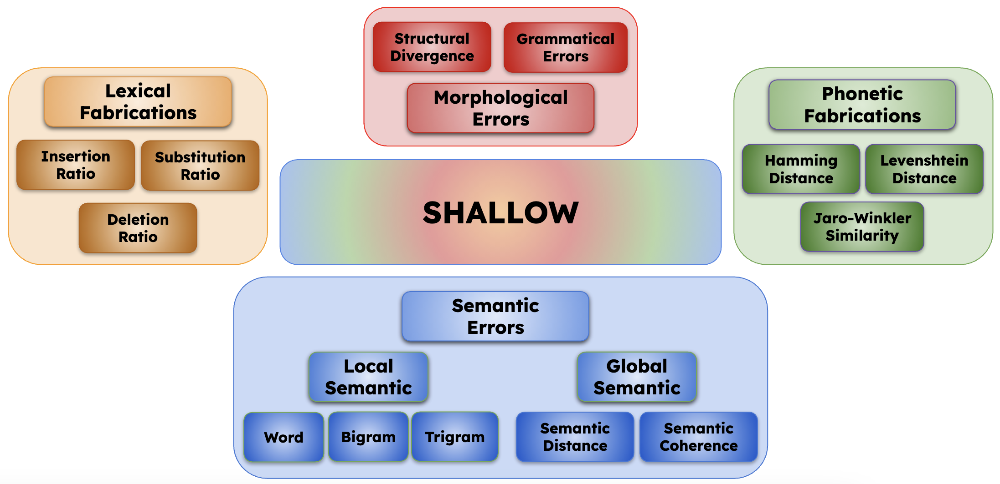

# SHALLOW Benchmark



We present SHALLOW, the first hallucination benchmark for ASR models.

SHALLOW extends traditional WER scores, and provides a more comprehensive evaluation of ASR models by measuring the model's ability to produce semantically and syntactically correct transcriptions. SHALLOW decomposes ASR errors into four complementary dimensions:
1. **Lexical Fabrications (LF)**: Content with no basis in the input audio, measured through insertion, substitution, and deletion ratios at a lexical level.
2. **Phonetic Fabrications (PF)**: Errors where the model generates phonetically similar but lexically incorrect words, measured using metaphone-based distance metrics.
3. **Morphological Hallucinations (MH)**: Structural and grammatical distortions that alter the linguistic form of the transcription.
4. **Semantic Hallucinations (SH)**: Meaning alterations captured at both local and global levels, measuring how semantic content is preserved or distorted.

## Table of Contents
- [Installation](#installation)
- [Usage](#usage)
- [Example](#example)
- [Datasets](#datasets)
- [Models](#models)
- [Results](#results)
- [License](#license)
- [Contact](#contact)
- [Citation](#citation)

## Installation
To install the required packages, run:
```bash
pip install -r requirements.txt
```

## Usage
To run the SHALLOW benchmark, use the following command:
```bash
python main.py \
 --dataset_name DATASET_NAME \
 --model_name MODEL_NAME \
 --gt_transcriptions_path hyp.txt \
 --predictions_path ref.txt \
 --output_dir results/ 
```
You should replace `DATASET_NAME` and `MODEL_NAME` with the appropriate values for your dataset and model. The `gt_transcriptions_path` and `predictions_path` should point to the ground truth and predicted transcriptions, respectively. The `output_dir` is where the results (i.e., metrics and statistics) will be saved. 

Please note that the `gt_transcriptions_path` and `predictions_path` should be in the format: <`<segment_id>: <transcription>`.
<br>
For example:
```
audio1.wav: this is the first audio
audio2.wav: this is the second audio
...
```

## Example
To run the SHALLOW benchmark on the CHiME6 dataset with the Canary 1B model, use the following command:
```bash
CUDA_DEVICE=0
DATASET_NAME=chime6
MODEL_NAME=canary1b

CUDA_VISIBLE_DEVICES=$CUDA_DEVICE python main.py \
 --dataset_name $DATASET_NAME \
 --model_name $MODEL_NAME \
 --gt_transcriptions_path gt/${DATASET_NAME}_gt.txt \
 --predictions_path inference/${DATASET_NAME}/${DATASET_NAME}_${MODEL_NAME}.txt \
 --output_dir results/ \
 --examples_limit 50 \
 --num_workers 2
```
This will run the SHALLOW benchmark on the first 50 examples of the CHiME6 dataset using the Canary 1B model, and save the results in the `results/` directory. The `--num_workers` argument specifies the number of workers to use for parallel processing. You can adjust this value based on your system's capabilities.

## Datasets
For speech data, we included multiple categories to test hallucination behavior across different conditions.
- **Standard Speech Conditions:** We use LibriSpeech-Other (read audiobooks), TEDLIUM (prepared presentations), and GIGASPEECH (multi-domain spoken content) to have standardized results on well-studied ASR domains;
- **Challenging Acoustic Environments:** CHiME-6 provides conversational speech recorded during real dinner parties with natural domestic noise, helping evaluate how environmental challenges may results in different types of hallucinations.
- **Heavily-Accented Domains:** We include CORAAL (African American Language varieties), CV16-Accented (accented English), GLOBE-v2 (164 worldwide English accents), and SpeechOcean (non-native English speakers with Mandarin as L1) to evaluate whether accent variation affects hallucination patterns.
- **Specialized Domains:** MyST Child includes children’s speech in educational contexts, while VoxPopuli contains formal political speeches, both representing domain-specific vocabulary that may trigger semantic or lexical hallucinations.

## Models
For model selection, we evaluated representative models from four distinct ASR architecture families to analyze how architectural choices influence hallucination behaviors:

- **Self-Supervised Speech Encoders:** HuBERT (*HuB*) employs masked prediction objectives with a focus on acoustic feature extraction, while *MMS* is a strongly multilingual encoder trained on 1,406 different languages for language-agnostic representation.
- **Encoder-Decoder Transformers:** Whisper-Large-v2 (*W-Lv2*) and Whisper-Large-v3 (*W-Lv3*) leverage large-scale weakly supervised training for strong generalization, while *Canary* uses token-driven decoding for formatting control. This model family balances acoustic and linguistic modeling through specific model sub-networks (e.g., encoder and decoder).
- **Encoder-Transducer Models:** We evaluate *Parakeet*, a FastConformer-based model with monotonic alignment between audio and text sequences. This creates a closer connection between acoustic and linguistic components.
- **Multimodal SpeechLLMs**: This newer paradigm includes models that extend linguistic modeling with multimodal speech processing. We include SALMONN (*SALM.*), Qwen2Audio (*Q2A*), Qwen2.5Omni (*Q2.5O*) Granite-Speech (*Granite*) , Kimi-Audio (*Kimi*), and Phi4-Multimodal-Instruct (*Phi*), which process speech within decoder-only language models, providing a bias towards strong language modeling capabilities.

## Results
The following table shows the results of the SHALLOW benchmark on various ASR models. The values represent the average scores across the 10 datasets used in the benchmark. The models are compared based on their performance in terms of WER, Lexical Fabrications, Phonetic Fabrications, Morphological Hallucinations, and Semantic Hallucination metrics.

| | **HuB** | **MMS** | **W-Lv2** | **Canary** | **W-Lv3** | **Parakeet** | **SALM.** | **Q2A** | **Granite** | **Kimi** | **Q2.5O** | **Phi4** |
|:---------------:|:----------------:|:----------------:|:------------------:|:-------------------:|:------------------:|:-----------------------------------:|:------------------:|:----------------:|:--------------------:|:-----------------:|:------------------:|:-----------------:|
| **WER** | 40.94 | 27.45 | 19.12 | 14.26 | 14.20 | 12.54 | 99.92 | 21.99 | 15.21 | 13.53 | 12.76 | 12.07 |
| **Lexical**  | 14.56 | 11.03 | 8.08  | 5.43  | 6.74  | 5.38  | 13.59 | 7.13  | 5.56  | 6.92  | 5.17  | 6.18  |
| **Phonetic**  | 42.87 | 34.38 | 35.98 | 33.92 | 34.70 | 33.36 | 40.80 | 36.75 | 34.18 | 35.14 | 33.85 | 33.89 |
| **Mophologic**  | 27.55 | 23.54 | 13.15 | 11.05 | 11.13 | 10.59 | 16.54 | 13.77 | 10.13 | 12.30 | 10.56 | 11.22 |
| **Semantic**  | 35.30 | 26.11 | 17.37 | 14.98 | 14.74 | 13.33 | 23.23 | 19.55 | 13.56 | 15.48 | 12.71 | 14.37 |

The figure below shows the comparison of the best models from each architecture type (*MMS* Encoder, *Parakeet* Encoder-Transducer, *Phi4-MM-IT Decoder-only) across evaluated speech datasets. The scores are displayed as performance metrics where higher values indicate better performance, i.e., the inverse of hallucination scores.


Please refer to the paper for detailed results and analysis of the SHALLOW benchmark. 


## License
This project is licensed under the MIT License. See the [LICENSE](LICENSE) file for details.

## Contact
For any questions or inquiries, please contact [Alkis Koudounas](mailto:alkis.koudounas@polito.it) or [Moreno La Quatra](mailto:moreno.laquatra@unikore.it).

## Citation
If you use SHALLOW in your research, please cite our paper.
<!-- ```bibtex
@inproceedings{Koudounas2025SHALLOW,
  title={SHALLOW: A Benchmark for Hallucination in Automatic Speech Recognition},
  author={Alkis Koudounas and Moreno La Quatra and Manuel Giollo and Marco Sabato Siniscalchi and Elena Baralis},
  booktitle={},
  year={}}
``` -->

